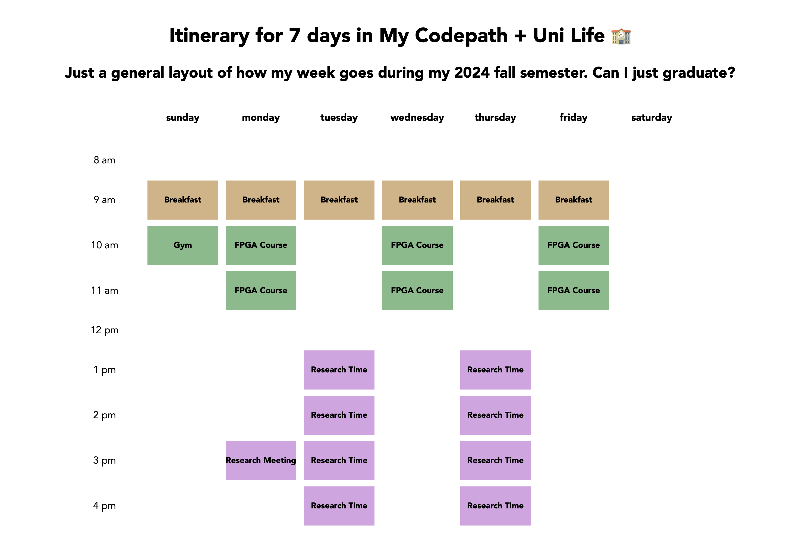

# Codepath Lab 1 -  Timetabled

## Overview

In this project, you will build a grid-style calendar with one-hour events that plan out a single week. You must create the calendar for someone else. This can be a friend, family member, historical figure, role model, or imaginary person. Timetables can be informative, humorous, or exploratory. For example:

- General: Plan a vacation for a friend, family member, or pet
- History: A week in the life of a historical figure, timeline of a coup
- Psychology: How to adapt to a polyphasic sleep cycle
- True crime: The week before a famous crime

## Required Features

- A one-week calendar that includes one-hour time blocks
- Events have different titles
- Events have different colors based on their type

## Stretch Features

- Event blocks have additional information, such as a description and location
- (My own stretch) - Use typescript instead

## Resources

- [Getting Started with Vite](https://vitejs.dev/guide)
- [ReactJS: Introducing JSX](https://reactjs.org/docs/introducing-jsx.html)
- [ReactJS: Rendering Elements](https://reactjs.org/docs/rendering-elements.html)
- [ReactJS: Components and Props](https://reactjs.org/docs/components-and-props.html)

## Demo

